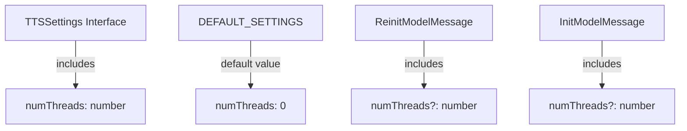
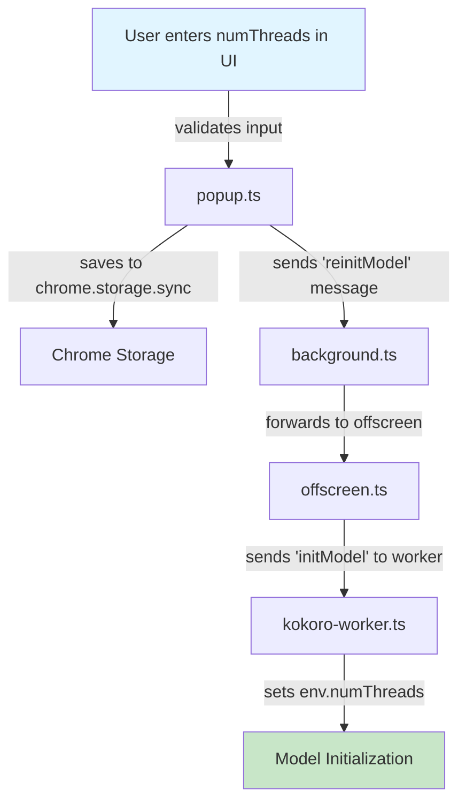

# Number of Threads Setting Implementation Plan

## Overview

Add a textbox in the Performance Settings section to allow users to specify the number of threads for TTS processing. The textbox should:

- Only be enabled when WebGPU is NOT selected (disabled when WebGPU is enabled)
- Only accept numeric input (including 0 as default)
- Save settings across sessions
- Pass the value from UI through the message chain to the worker
- When set to 0, pass 0 directly to onnxruntime (which handles 0 as auto-detect)

## Current Implementation Analysis

### Data Flow

The current implementation uses the following flow for settings:

```
popup.ts (UI)
  ↓ (saves to chrome.storage.sync)
  ↓ (sends message 'reinitModel' with useWebGPU)
background.ts
  ↓ (forwards message to offscreen)
offscreen.ts
  ↓ (sends 'initModel' message to worker)
kokoro-worker.ts (sets env.numThreads)
```

### Current Hard-coded Value

In [`kokoro-worker.ts`](src/kokoro-worker.ts:5):

```typescript
env.numThreads = Math.max(8, navigator.hardwareConcurrency);
```

**Change needed**: Replace this with direct assignment of `numThreads` parameter (0 or specified value).

### How useWebGPU Currently Works

1. **Types** ([`types.ts`](src/types.ts:39-44)): `TTSSettings` interface includes `useWebGPU`
2. **UI** ([`popup.html`](src/popup.html:556-567)): WebGPU toggle checkbox
3. **State** ([`popup.ts`](src/popup.ts:15)): `currentUseWebGPU` variable
4. **Storage** ([`popup.ts`](src/popup.ts:18-32)): Saved in `saveSettings()` function
5. **Message** ([`popup.ts`](src/popup.ts:464-492)): Sends 'reinitModel' with `useWebGPU` param
6. **Background** ([`background.ts`](src/background.ts:152-175)): Forwards to offscreen
7. **Offscreen** ([`offscreen.ts`](src/offscreen.ts:454-474)): Calls `initKokoroModel(useWebGPU)`
8. **Worker** ([`kokoro-worker.ts`](src/kokoro-worker.ts:47-93)): Uses `useWebGPU` to determine device

## Implementation Steps

### 1. Update Types ([`types.ts`](src/types.ts))

#### Changes needed:

- Add `numThreads` to [`TTSSettings`](src/types.ts:39-44) interface
- Add default value in [`DEFAULT_SETTINGS`](src/types.ts:46-52)
- Add `numThreads` to [`ReinitModelMessage`](src/types.ts:93-96) interface
- Add `numThreads` to [`ReinitModelOffscreenMessage`](src/types.ts:143-147) interface
- Add `numThreads` to [`InitModelMessage`](src/types.ts:137-141) interface (optional param)



### 2. Update UI ([`popup.html`](src/popup.html))

#### Add textbox in Performance Settings section (after WebGPU toggle):

Location: Inside the "Performance Settings" [`settings-section`](src/popup.html:554-568), after the WebGPU toggle

```html
<!-- Add after the webgpuToggle div, before closing settings-section -->
<div class="input-group" style="margin-top: 10px;">
  <label for="numThreadsInput">Number of Threads (0 = auto):</label>
  <input type="number" id="numThreadsInput" class="text-control" min="0" step="1" value="0" placeholder="0 for auto" />
  <p class="toggle-description">
    Specify thread count for WASM processing. 0 uses automatic detection. Only applies when WebGPU is disabled.
  </p>
</div>
```

#### Add CSS for text-control class:

```css
.text-control {
  width: 100%;
  padding: 10px;
  border: 2px solid var(--primary);
  border-radius: var(--radius);
  background-color: var(--paper);
  font-family: 'Libre Baskerville', Georgia, serif;
  color: var(--text);
  font-size: 14px;
  transition: var(--transition);
}

.text-control:focus {
  outline: none;
  border-color: var(--primary-light);
  box-shadow: 0 0 0 3px rgba(116, 77, 38, 0.2);
}

.text-control:disabled {
  background-color: #f5f5f5;
  cursor: not-allowed;
  opacity: 0.6;
}

.input-group {
  margin: 10px 0;
}
```

### 3. Update Popup Logic ([`popup.ts`](src/popup.ts))

#### Add state variable:

```typescript
let currentNumThreads: number = DEFAULT_SETTINGS.numThreads;
```

Location: After line 15, with other current\* variables

#### Update [`saveSettings()`](src/popup.ts:18-32):

```typescript
const settings: TTSSettings = {
  voice: currentVoice,
  speed: currentSpeed,
  pitch: currentPitch,
  useWebGPU: currentUseWebGPU,
  numThreads: currentNumThreads // Add this
};
```

#### Update [`loadSettings()`](src/popup.ts:34-60):

```typescript
currentNumThreads = result.ttsSettings.numThreads ?? DEFAULT_SETTINGS.numThreads;
// Also update in default/error cases
```

#### Add in DOMContentLoaded (after line 350):

```typescript
const numThreadsInput = document.getElementById('numThreadsInput') as HTMLInputElement;
```

#### Add after line 362 (in loadSettings().then()):

```typescript
numThreadsInput.value = currentNumThreads.toString();
// Set initial disabled state based on WebGPU
numThreadsInput.disabled = currentUseWebGPU;
```

#### Update WebGPU toggle handler (around line 464):

```typescript
webgpuToggle.addEventListener('change', async function () {
  const newUseWebGPU = this.checked;

  // Enable/disable numThreads input based on WebGPU state
  numThreadsInput.disabled = newUseWebGPU;

  if (newUseWebGPU !== currentUseWebGPU) {
    currentUseWebGPU = newUseWebGPU;
    await saveSettings();
    showStatus('Reinitializing model with new settings...', 'loading', false);

    try {
      await chrome.runtime.sendMessage({
        type: 'reinitModel',
        useWebGPU: currentUseWebGPU,
        numThreads: currentNumThreads // Add this
      });

      showStatus('Model reinitialized successfully', 'loading', true);
    } catch (error: any) {
      showErrorStatus(`Failed to reinitialize model: ${error.message}`);
      this.checked = !newUseWebGPU;
      currentUseWebGPU = !newUseWebGPU;
      numThreadsInput.disabled = currentUseWebGPU;
    }
  }
});
```

#### Add numThreads input handler:

```typescript
// Add event listener for numThreads input
numThreadsInput.addEventListener('input', function () {
  const value = parseInt(this.value, 10);

  // Validate: only allow non-negative integers
  if (isNaN(value) || value < 0) {
    this.value = currentNumThreads.toString();
    return;
  }

  currentNumThreads = value;
});

numThreadsInput.addEventListener('change', async function () {
  // Validate again on change
  const value = parseInt(this.value, 10);

  if (isNaN(value) || value < 0) {
    this.value = currentNumThreads.toString();
    showErrorStatus('Number of threads must be a non-negative integer');
    return;
  }

  currentNumThreads = value;

  // Save the setting
  await saveSettings();

  // Only reinitialize if not using WebGPU (numThreads only affects WASM)
  if (!currentUseWebGPU) {
    showStatus('Reinitializing model with new thread count...', 'loading', false);

    try {
      await chrome.runtime.sendMessage({
        type: 'reinitModel',
        useWebGPU: currentUseWebGPU,
        numThreads: currentNumThreads
      });

      showStatus('Model reinitialized successfully', 'loading', true);
    } catch (error: any) {
      showErrorStatus(`Failed to reinitialize model: ${error.message}`);
    }
  } else {
    // Just save, don't reinitialize (WebGPU doesn't use threads)
    showStatus('Thread count saved', 'loading', true);
  }
});
```

### 4. Update Background Script ([`background.ts`](src/background.ts))

#### Update [`reinitModel` handler](src/background.ts:152-175):

```typescript
} else if (message.type === 'reinitModel') {
  // Reinitialize the model with new WebGPU setting
  (async () => {
    try {
      await ensureOffscreenDocument();

      // Send message to offscreen document to reinitialize model
      await chrome.runtime.sendMessage({
        target: 'offscreen',
        type: 'reinitModel',
        useWebGPU: message.useWebGPU,
        numThreads: message.numThreads  // Add this
      });

      sendResponse({ success: true });
    } catch (error: any) {
      console.error('Error reinitializing model:', error);
      sendResponse({
        success: false,
        error: error.message || 'Unknown error'
      });
    }
  })();
  return true;
}
```

#### Update [`readTextWithCustomTTS()`](src/background.ts:404-483) to load and pass numThreads:

```typescript
async function readTextWithCustomTTS(
  text: string,
  voice?: string | null,
  speed?: number | null,
  pitch?: number | null
): Promise<void> {
  // ... existing code ...

  // Load settings to get useWebGPU and numThreads
  const settings = await loadSettings();
  let useWebGPU = settings.useWebGPU;
  let numThreads = settings.numThreads; // Add this

  // ... existing code ...

  // Send message to offscreen document to play audio
  await chrome.runtime.sendMessage({
    target: 'offscreen',
    type: 'playAudio',
    text: text,
    voice: voice || undefined,
    speed: speed || undefined,
    pitch: pitch || undefined,
    useWebGPU: useWebGPU,
    numThreads: numThreads // Add this
  });
}
```

#### Update TTS engine [`onSpeak` handler](src/background.ts:245-322):

```typescript
chrome.ttsEngine.onSpeak.addListener(async (utterance, options, sendTtsEvent) => {
  // ... existing code ...

  // Send message to offscreen document to play audio with saved settings
  await chrome.runtime.sendMessage({
    target: 'offscreen',
    type: 'playAudio',
    text: utterance,
    voice: settings.voice,
    speed: settings.speed,
    pitch: settings.pitch,
    useWebGPU: settings.useWebGPU,
    numThreads: settings.numThreads // Add this
  });

  // ... rest of code ...
});
```

### 5. Update Offscreen Script ([`offscreen.ts`](src/offscreen.ts))

#### Update [`initKokoroModel()`](src/offscreen.ts:52-132) signature:

```typescript
async function initKokoroModel(useWebGPU: boolean = false, numThreads?: number): Promise<void> {
  // ... existing code ...

  kokoroWorker!.postMessage({
    id: messageId,
    type: 'initModel',
    data: {
      voicePath: chrome.runtime.getURL('voices') || '/voices',
      useWebGPU,
      numThreads // Add this
    }
  });
}
```

#### Update [`reinitializeModel()`](src/offscreen.ts:454-474):

```typescript
async function reinitializeModel(useWebGPU: boolean, numThreads?: number): Promise<void> {
  console.log(`Reinitializing model with WebGPU: ${useWebGPU}, numThreads: ${numThreads}`);

  // ... existing code ...

  // Reinitialize with new settings
  await initKokoroModel(useWebGPU, numThreads);
}
```

#### Update message listener (around line 559):

```typescript
chrome.runtime.onMessage.addListener(async (message: OffscreenMessage, _sender, sendResponse) => {
  if (message.target === 'offscreen') {
    if (message.type === 'playAudio' && message.text) {
      if (!isModelReady) {
        try {
          const useWebGPU = message.useWebGPU ?? true;
          const numThreads = message.numThreads; // Add this
          await initKokoroModel(useWebGPU, numThreads); // Pass numThreads
        } catch (error: any) {
          // ...
        }
      }
      // ... rest of code ...
    } else if (message.type === 'reinitModel') {
      try {
        await reinitializeModel(message.useWebGPU, message.numThreads); // Add numThreads
        sendResponse({ success: true });
      } catch (error: any) {
        // ...
      }
      return true;
    }
    // ... rest of code ...
  }
});
```

### 6. Update Worker ([`kokoro-worker.ts`](src/kokoro-worker.ts))

#### Update [`InitModelData`](src/kokoro-worker.ts:27-30) interface:

```typescript
interface InitModelData {
  voicePath: string;
  useWebGPU?: boolean;
  numThreads?: number; // Add this
}
```

#### Update [`initKokoroModel()`](src/kokoro-worker.ts:47-93):

```typescript
async function initKokoroModel(
  voicePath: string,
  useWebGPU: boolean = false,
  numThreads: number = 0 // Add this parameter, default to 0
): Promise<void> {
  if (kokoroModel || isModelLoading) {
    console.log('Model already loaded or loading in worker');
    return;
  }

  console.log('worker: voicePath', voicePath);
  console.log('worker: useWebGPU', useWebGPU);
  console.log('worker: numThreads', numThreads); // Add logging

  env.voicePath = voicePath;

  // Set numThreads directly - onnxruntime handles 0 as auto-detect
  env.numThreads = numThreads;
  console.log(`Using thread count: ${numThreads} (0 = auto-detect by onnxruntime)`);

  isModelLoading = true;

  // ... rest of existing code ...
}
```

#### Update message handler (around line 210):

```typescript
switch (type) {
  case 'initModel':
    const initData = data as InitModelData;
    console.log('initData', initData);
    await initKokoroModel(
      initData?.voicePath,
      initData?.useWebGPU || false,
      initData?.numThreads // Add this
    );

    const modelResponse: WorkerResponse = {
      id,
      type: 'modelReady',
      data: { success: true }
    };
    self.postMessage(modelResponse);
    break;
  // ... rest of code ...
}
```

## Data Flow Diagram



## Testing Checklist

- [ ] Textbox appears in Performance Settings section
- [ ] Textbox is disabled when WebGPU is enabled
- [ ] Textbox is enabled when WebGPU is disabled
- [ ] Textbox only accepts numeric input (integers >= 0)
- [ ] Value 0 is accepted and uses auto-detection
- [ ] Setting saves across browser sessions
- [ ] Changing value triggers model reinitialization (when WebGPU disabled)
- [ ] Model uses the specified thread count
- [ ] Model uses auto-detection when numThreads is 0
- [ ] Console logs show correct thread count being used
- [ ] No errors in console during normal operation

## Edge Cases to Handle

1. **Invalid Input**: Non-numeric or negative values should be rejected
2. **Empty Input**: Should default to 0 (auto-detection)
3. **Very Large Values**: Should be capped at reasonable maximum (maybe 32?)
4. **WebGPU Enabled**: numThreads should be saved but not applied (only for WASM)
5. **Migration**: Existing users without numThreads setting should get default value

## Default Value Rationale

Default `numThreads: 0` means:

- 0 = Let onnxruntime auto-detect thread count
- This is simpler and lets the backend handle the logic
- Users can override if they want specific thread count (e.g., 1, 2, 4, 8, etc.)
- No need for JavaScript-side auto-detection logic
