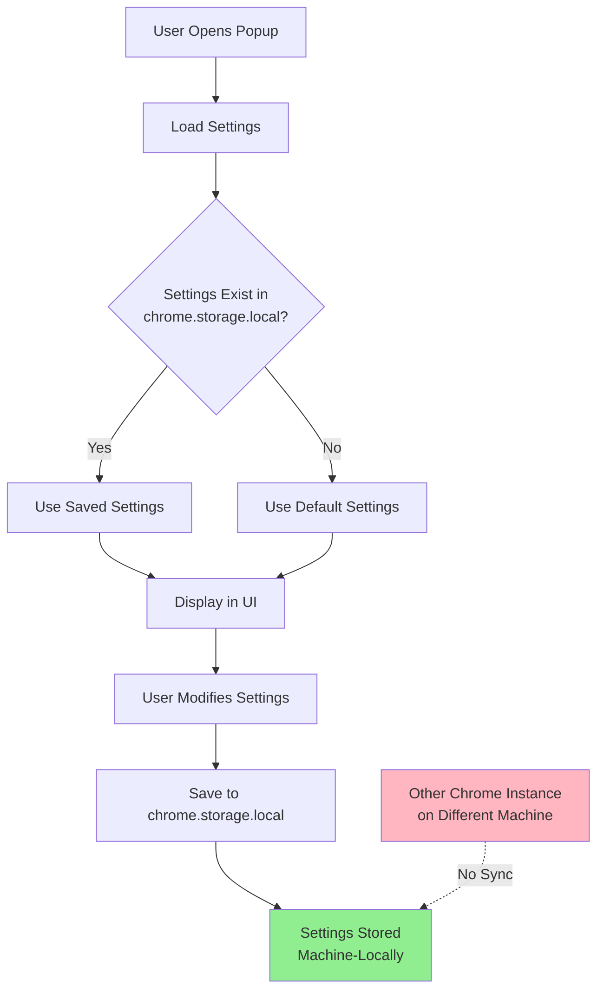

# Chrome Extension Storage Migration Plan

## Problem Statement

The Kokoro TTS Chrome extension currently uses `chrome.storage.sync` to store user settings, which causes settings to be synchronized across all Chrome instances where the user is signed in. This is problematic because:

1. **Hardware Capability Differences**: Different machines have different capabilities

   - Some machines support WebGPU, others don't
   - Different machines have different CPU core counts (affecting `numThreads` setting)

2. **Settings Affected**:
   - `useWebGPU`: Boolean flag for GPU acceleration
   - `numThreads`: Number of threads for WASM execution
   - `voice`: Selected voice (less critical but still user preference)
   - `speed`: Playback speed (user preference)
   - `pitch`: Pitch adjustment (user preference)

## Solution

Migrate from `chrome.storage.sync` to `chrome.storage.local` to store settings locally on each machine.

## Analysis

### Current Implementation

**Files Using Storage:**

- [`src/background.ts`](src/background.ts:385): Loads settings using `chrome.storage.sync.get()`
- [`src/popup.ts`](src/popup.ts:29): Saves settings using `chrome.storage.sync.set()`
- [`src/popup.ts`](src/popup.ts:39): Loads settings using `chrome.storage.sync.get()`

**Storage Key:** `'ttsSettings'`

**Settings Structure (TTSSettings interface):**

```typescript
{
  voice: string; // e.g., 'af_heart'
  speed: number; // e.g., 1.0
  pitch: number; // e.g., 1.0
  useWebGPU: boolean; // e.g., true
  numThreads: number; // e.g., 0 (auto-detect)
}
```

### Permissions

The [`manifest.json`](manifest.json:6) already includes `"storage"` permission, which grants access to both `chrome.storage.sync` and `chrome.storage.local`. No manifest changes required.

## Implementation Steps

### 1. Update background.ts

**Location:** [`src/background.ts`](src/background.ts:385)

**Change:**

```typescript
// FROM:
const result = await chrome.storage.sync.get('ttsSettings');

// TO:
const result = await chrome.storage.local.get('ttsSettings');
```

**Function:** [`loadSettings()`](src/background.ts:383)

### 2. Update popup.ts (Save)

**Location:** [`src/popup.ts`](src/popup.ts:29)

**Change:**

```typescript
// FROM:
await chrome.storage.sync.set({ ttsSettings: settings });

// TO:
await chrome.storage.local.set({ ttsSettings: settings });
```

**Function:** [`saveSettings()`](src/popup.ts:19)

### 3. Update popup.ts (Load)

**Location:** [`src/popup.ts`](src/popup.ts:39)

**Change:**

```typescript
// FROM:
const result = await chrome.storage.sync.get('ttsSettings');

// TO:
const result = await chrome.storage.local.get('ttsSettings');
```

**Function:** [`loadSettings()`](src/popup.ts:37)

## Migration Considerations

### Data Migration

When users update to the new version:

- Old synced settings will remain in `chrome.storage.sync`
- The extension will start using `chrome.storage.local` instead
- Default settings will be used initially on each machine
- Users will need to reconfigure their settings per machine (expected behavior)

### Optional: One-time Migration

If we want to preserve existing settings during the update, we could implement a one-time migration:

```typescript
// Check if local settings exist
const local = await chrome.storage.local.get('ttsSettings');
if (!local.ttsSettings) {
  // Try to get from sync storage
  const synced = await chrome.storage.sync.get('ttsSettings');
  if (synced.ttsSettings) {
    // Copy to local storage
    await chrome.storage.local.set({ ttsSettings: synced.ttsSettings });
    // Optionally clear sync storage
    await chrome.storage.sync.remove('ttsSettings');
  }
}
```

**Decision:** This migration step is **optional** and could be added to the [`chrome.runtime.onInstalled`](src/background.ts:533) listener in [`background.ts`](src/background.ts:533). For simplicity, we may skip it and accept that users will need to reconfigure settings.

## Testing Checklist

- [ ] Settings are saved successfully after changes
- [ ] Settings persist after closing and reopening the popup
- [ ] Settings persist after browser restart
- [ ] Settings do NOT sync to other Chrome instances (verify on two machines)
- [ ] Default settings are used when no settings exist
- [ ] All settings work correctly:
  - [ ] Voice selection
  - [ ] Speed adjustment
  - [ ] Pitch adjustment
  - [ ] WebGPU toggle
  - [ ] NumThreads input

## Impact Assessment

### Benefits

✅ Settings are machine-specific (appropriate for hardware-dependent settings)
✅ No unintended sync conflicts between machines
✅ Each machine can have optimal settings for its hardware

### Drawbacks

❌ Users need to configure settings on each machine
❌ Voice/speed/pitch preferences won't sync (but this is acceptable)

### Risk Level

**LOW** - This is a straightforward API change with minimal risk:

- Same API surface (`get()` and `set()` methods)
- No data structure changes
- Existing code logic remains the same
- Only changes storage backend

## Documentation Updates

### CHANGELOG Entry

```markdown
### Changed

- Settings are now stored locally on each machine instead of being synced across Chrome instances. This ensures that hardware-specific settings (WebGPU, thread count) are appropriate for each machine's capabilities.
```

## Mermaid Diagram: Storage Flow



## Conclusion

This migration is straightforward and addresses the core issue of hardware-specific settings being synced inappropriately. The change involves updating three lines of code to replace `chrome.storage.sync` with `chrome.storage.local`, with no other modifications needed.
